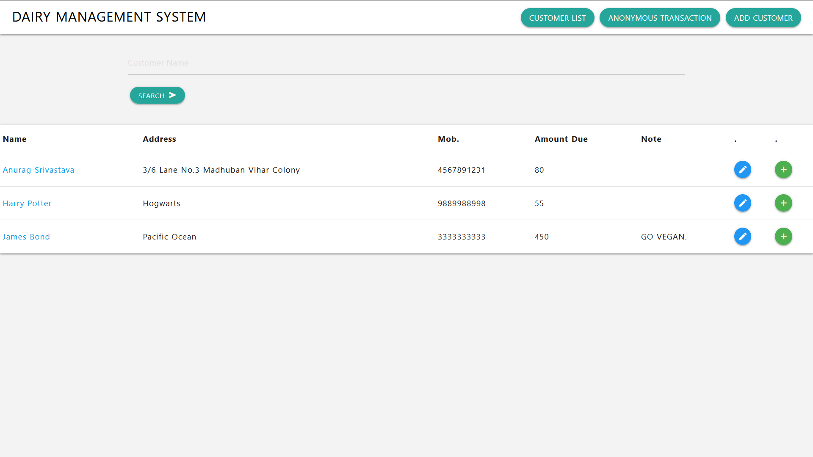
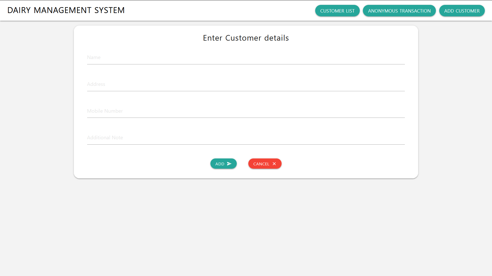
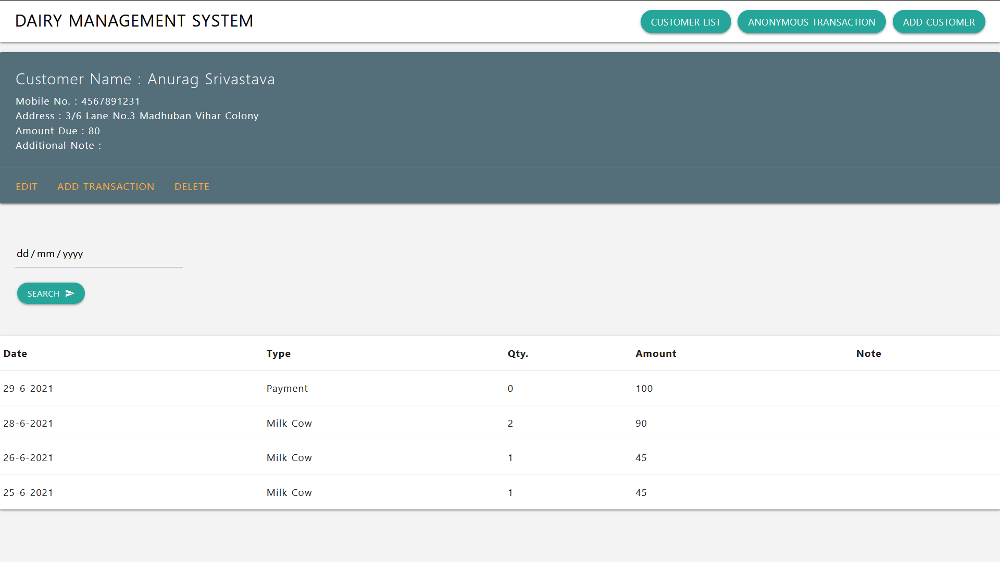
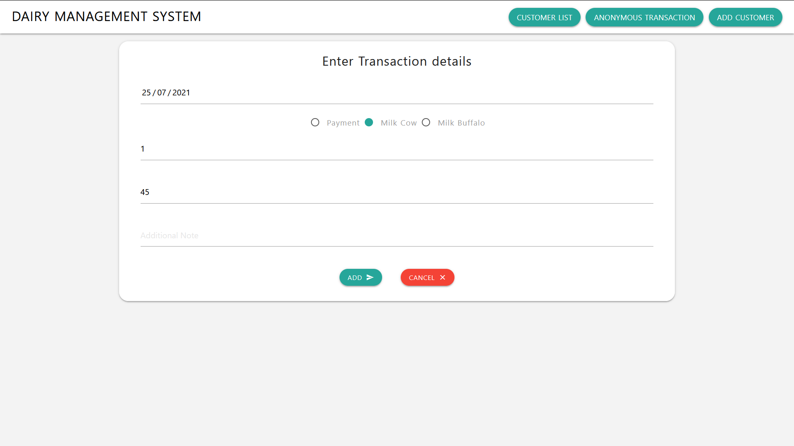

# dairy_management
# Web application for maintaining transactions and customer records.
Technologies Used: NODE.JS, SQL, EJS, MATERIALIZE (JS AND CSS)

Stores list of all transactions ordered by date in descending order. Transactions can be filtered for a particular date. Anonymous transaction feature is used for speedy transactions where customer details do not matter.

List of all Customers ordered by Name. List can be filtered by Customer Name.

Customer Registration Page.

New Transaction Page.

# SQL SCHEMA:

Customer Schema:

CREATE TABLE Customers(\
ID int NOT NULL AUTO_INCREMENT,\
NAME varchar(30) NOT NULL,\
ADDRESS Varchar(50) NOT NULL,\
MOBILE bigint NOT NULL,\
NOTE varchar(50),\
DUE int DEFAULT 0,\
PRIMARY KEY (ID)\
);

Transaction Schema:

CREATE TABLE Transactions(\
ID int NOT NULL AUTO_INCREMENT,\
CID int NOT NULL,\
NAME varchar(30) NOT NULL,\
DATEE DATE NOT NULL,\
TYPE varchar(20) NOT NULL,\
QTY int,\
AMOUNT int NOT NULL,\
NOTE varchar(30),\
PRIMARY KEY (ID)\
);
